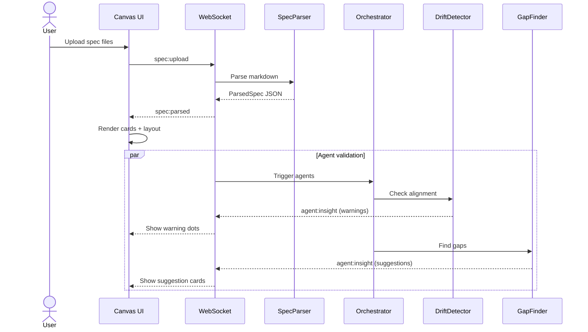
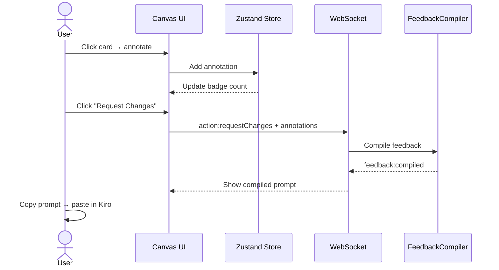

# Design — Respec

## System Architecture

Respec is a single-page Next.js application with a WebSocket-enabled backend for real-time agent communication. The frontend is a React Flow canvas; the backend orchestrates Strands agents via API routes.

---

## Component Design

### 1. SpecParser

Transforms raw Kiro markdown specs into structured JSON.

```
Input:  .kiro/specs/*/requirements.md, design.md, tasks.md
Output: ParsedSpec { requirements: Requirement[], design: DesignElement[], tasks: Task[] }
```

**Parsing rules:**
- Requirements: Match lines with EARS keywords (WHEN, WHILE, WHERE, IF, SHALL). Extract ID from bold prefix pattern `**FR-X.Y**`.
- Design: Match H3 headers as component names. Extract Mermaid blocks (```mermaid). Extract bullet points as properties.
- Tasks: Match checkbox patterns `- [ ]`, `- [x]`, `- [-]`. Map to todo/done/in-progress.
- Cross-references: Scan for `FR-X.Y` patterns in design and task text to build `implementsRequirements` arrays.

### 2. Canvas Layout (React Flow)

```
┌──────────────────────────────────────────────────────────────┐
│  [Respec]              [Upload Specs]  [Agent Rail ▸]   │
├──────────────────────────────────────────────────────────────┤
│                                                              │
│  ┌─ Requirements ──┐  ┌─── Design ─────┐  ┌─── Tasks ────┐ │
│  │                 │  │                 │  │              │ │
│  │  ┌───────────┐  │  │  ┌───────────┐  │  │  ┌────────┐ │ │
│  │  │ FR-1.1    │  │  │  │ Component │  │  │  │ □ Task │ │ │
│  │  │ WHEN user │──┼──┼──│ SpecParser│──┼──┼──│   1    │ │ │
│  │  │ uploads...│  │  │  │           │  │  │  │        │ │ │
│  │  └───────────┘  │  │  └───────────┘  │  │  └────────┘ │ │
│  │                 │  │                 │  │              │ │
│  │  ┌───────────┐  │  │  ┌───────────┐  │  │  ┌────────┐ │ │
│  │  │ FR-1.2    │  │  │  │ Mermaid   │  │  │  │ ☑ Task │ │ │
│  │  │ WHEN spec │  │  │  │ ┌──┐ ┌──┐ │  │  │  │   2    │ │ │
│  │  │ contains..│  │  │  │ │  │→│  │ │  │  │  │        │ │ │
│  │  └───────────┘  │  │  └───────────┘  │  │  └────────┘ │ │
│  │                 │  │                 │  │              │ │
│  └─────────────────┘  └─────────────────┘  └──────────────┘ │
│                                                              │
├──────────────────────────────────────────────────────────────┤
│  [✓ Approve]  [✎ Request Changes]     3 annotations pending │
└──────────────────────────────────────────────────────────────┘
```

**Layout algorithm:** Three fixed-x columns at x=0, x=500, x=1000. Cards within each column use dagre for vertical positioning with 20px gap. Cross-link edges use `smoothstep` edge type with animated stroke-dasharray.

### 3. Node Types

#### EarsCard (Requirements)
```
┌─────────────────────────────┐
│ 🔵 FR-1.1          [must]   │
│─────────────────────────────│
│ WHEN user uploads spec files│
│ THE SYSTEM SHALL parse them │
│ into structured JSON...     │
│─────────────────────────────│
│ 💬 2 annotations    🔴 drift│
└─────────────────────────────┘
```
- Blue left border
- Priority badge (must/should/could)
- EARS keywords highlighted in bold
- Annotation count badge
- Agent warning dot (if flagged)

#### MermaidNode (Design)
```
┌─────────────────────────────┐
│ 🟣 Sequence: Auth Flow      │
│─────────────────────────────│
│  ┌──────┐    ┌──────┐      │
│  │Client│───▸│Server│      │
│  └──────┘    └──────┘      │
│  (rendered mermaid SVG)     │
│─────────────────────────────│
│ Implements: FR-2.1, FR-2.3 │
└─────────────────────────────┘
```
- Purple left border
- Mermaid diagram rendered via mermaid.js
- Clickable nodes within diagram highlight linked requirements

#### TaskCard (Tasks)
```
┌─────────────────────────────┐
│ 🟢 T-3: Build SpecParser    │
│─────────────────────────────│
│ [●] in-progress             │
│ Implements: FR-1.1, FR-1.2  │
│─────────────────────────────│
│ ▸ Parse EARS keywords       │
│ ▸ Extract Mermaid blocks    │
└─────────────────────────────┘
```
- Green left border
- Status: □ todo, ● in-progress (pulsing), ☑ done
- Subtasks as indented list
- Pulsing ring animation when in-progress

#### AgentInsightCard
```
┌─────────────────────────────┐
│ ⚠️ GapFinder                 │
│─────────────────────────────│
│ Missing: error handling for │
│ invalid markdown input      │
│─────────────────────────────│
│ [Accept]  [Dismiss]         │
└─────────────────────────────┘
```
- Amber border for suggestions, red for errors
- Accept adds a new requirement card
- Dismiss removes with fade-out animation

### 4. Cross-Link Edge

Custom React Flow edge with:
- `animated: true` — dashed stroke animation
- Glow filter on hover (SVG `feGaussianBlur` + `feComposite`)
- Color by type: blue (implements), orange (depends), red (conflicts)
- Opacity mapped to `strength` value (0.3 – 1.0)
- Only visible on hover of source or target node

### 5. Annotation System

**State:** Zustand store with `annotations: Map<targetId, Annotation[]>`

**Popover UI:**
```
┌─────────────────────────────┐
│ Annotating: FR-1.1          │
│─────────────────────────────│
│ Action: [Comment ▾]         │
│ ┌─────────────────────────┐ │
│ │ This should also handle │ │
│ │ YAML frontmatter...     │ │
│ └─────────────────────────┘ │
│ [Cancel]          [Submit]  │
└─────────────────────────────┘
```

Actions: Comment, Split (→ 2 cards), Remove (→ strikethrough), Clarify (→ question mark badge)

### 6. Agent Orchestrator

```
                    ┌──────────────┐
                    │  Orchestrator │
                    └──────┬───────┘
                           │
              ┌────────────┼────────────┐
              ▼            ▼            ▼
      ┌──────────┐ ┌──────────┐ ┌──────────┐
      │  Drift   │ │   Gap    │ │ Feedback │
      │ Detector │ │  Finder  │ │ Compiler │
      └──────────┘ └──────────┘ └──────────┘
```

**Trigger rules:**
- DriftDetector: runs on spec load and on any spec modification
- GapFinder: runs on spec load (once)
- FeedbackCompiler: runs on "Request Changes" click
- TestSynthesizer: runs on "Approve" click (stretch goal)

**Agent communication:** Each agent is a Strands Agent with a system prompt and tool definitions. They receive the full parsed spec as context and return structured JSON responses.

### 7. WebSocket Protocol

```
Client → Server:
  { type: "spec:upload", payload: { requirements: string, design: string, tasks: string } }
  { type: "annotation:add", payload: Annotation }
  { type: "annotation:remove", payload: { id: string } }
  { type: "action:approve" }
  { type: "action:requestChanges" }

Server → Client:
  { type: "spec:parsed", payload: ParsedSpec }
  { type: "agent:thinking", payload: { agent: string, message: string } }
  { type: "agent:insight", payload: AgentInsight }
  { type: "agent:complete", payload: { agent: string } }
  { type: "task:statusChange", payload: { taskId: string, status: string } }
  { type: "feedback:compiled", payload: { prompt: string } }
```

---

## Sequence Diagrams

### Spec Upload Flow


### Annotation → Feedback Flow


---

## Data Model (in-memory, no DB)

```typescript
// Global state (Zustand)
interface RespecState {
  // Spec data
  spec: ParsedSpec | null;
  
  // Canvas state
  nodes: Node[];
  edges: Edge[];
  hoveredNodeId: string | null;
  
  // Annotations
  annotations: Map<string, Annotation[]>;
  
  // Agent state
  agentActivity: AgentLogEntry[];
  insights: AgentInsight[];
  
  // UI state
  approvalStatus: 'pending' | 'approved' | 'changes-requested';
  railOpen: boolean;
  
  // Actions
  setSpec: (spec: ParsedSpec) => void;
  addAnnotation: (annotation: Annotation) => void;
  removeAnnotation: (id: string) => void;
  acceptInsight: (id: string) => void;
  dismissInsight: (id: string) => void;
  approve: () => void;
  requestChanges: () => void;
}
```
