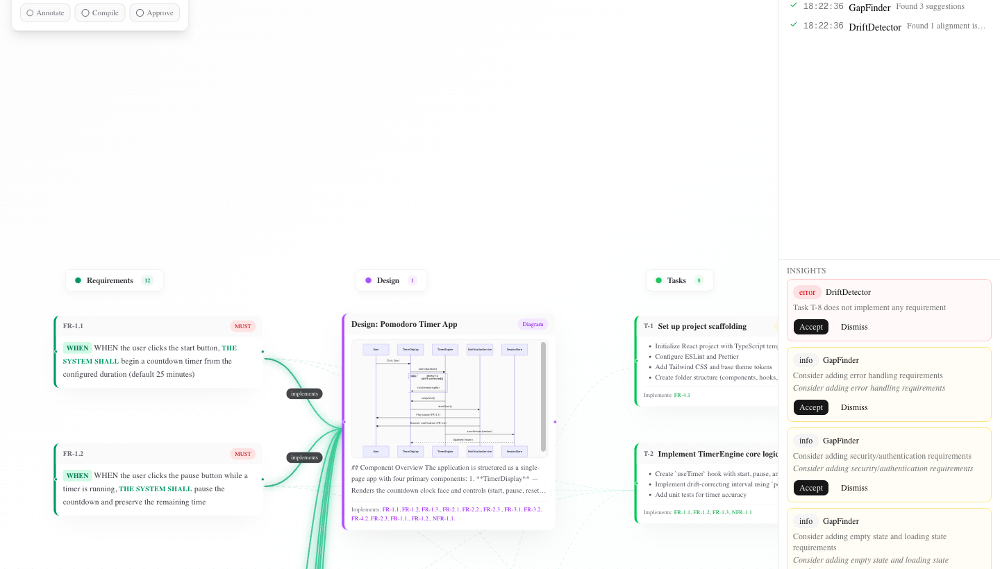
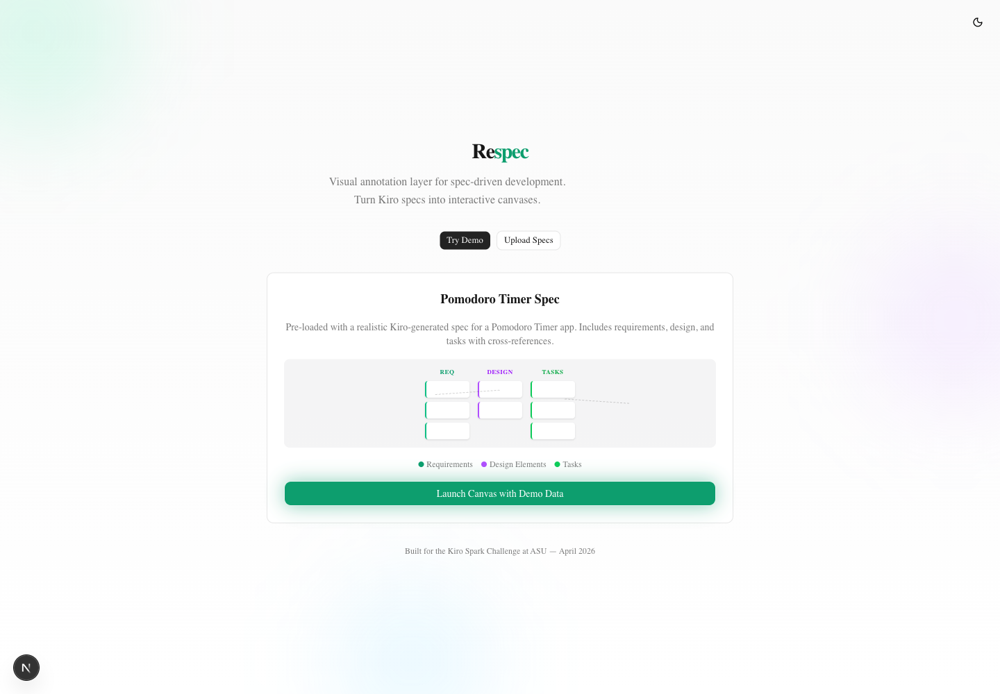
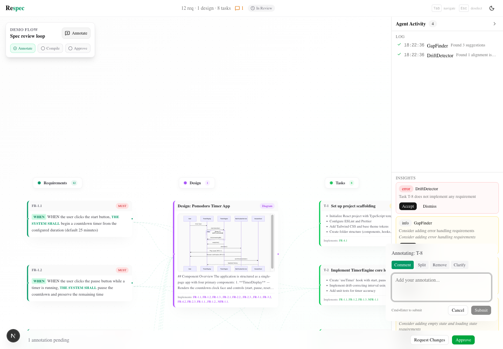
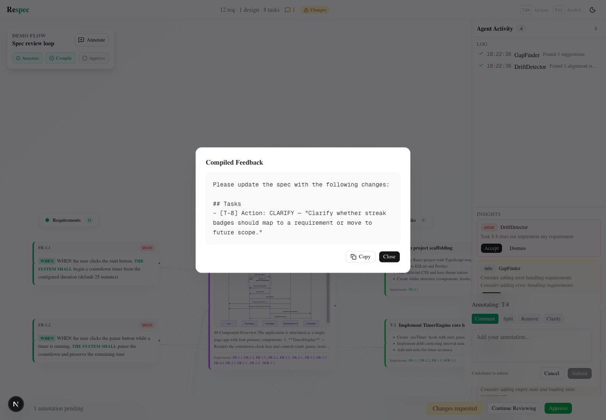

# Respec

**Visual review UI for Kiro-style specs.**

Respec turns `requirements.md`, `design.md`, and `tasks.md` into an interactive canvas where reviewers can see coverage, flag issues, compile feedback, and approve a spec.

[Live Demo](https://respec-ai.vercel.app) | [Architecture](docs/ARCHITECTURE.md)



## Demo Flow

The demo runs as a complete review loop:

| Start | Review |
|-------|--------|
|  |  |

| Annotate | Compile feedback |
|----------|------------------|
|  |  |

1. Pick a sample spec (Pomodoro Timer, URL Shortener API, or Realtime Chat) — or paste your own.
2. Review the canvas: cross-links, agent flags on the cards, and the activity rail.
3. Annotate an issue (the Pomodoro demo includes a guided walkthrough).
4. Click **Request Changes** to compile structured feedback, then **Download** it as Markdown or **Copy** it.
5. **Share** the review — the link rebuilds the exact annotated canvas, no backend required.
6. Continue reviewing or approve the spec.

## What It Shows

- Three-column spec canvas: requirements, design, tasks.
- Cross-links from requirements to implementation work, with agent flags surfaced on the cards and minimap.
- Multiple sample specs plus bring-your-own upload.
- Deterministic DriftDetector and GapFinder demo agents (a preview of what Kiro's Claude/Bedrock agents surface).
- Typed annotations: comment, split, remove, clarify.
- FeedbackCompiler output ready to download, copy, or paste into Kiro or another agent.
- Shareable review links that round-trip the full canvas state through the URL.
- Responsive layout: the canvas chrome adapts to mobile (drawer rail, bottom-sheet annotations).
- VS Code extension path that reads `.kiro/specs/` and writes `.kiro/respec/` review artifacts.

## Run Locally

```bash
git clone https://github.com/shitijkarsolia/respec.git
cd respec/respec
npm ci
npm run dev
```

Open [http://localhost:3000](http://localhost:3000).

## Verify

```bash
cd respec
npm ci
npm run lint
npm run build
npm audit

cd ../respec-extension
npm ci
cd webview && npm ci && cd ..
npm run build
npm audit
cd webview && npm audit
```

## Repo Map

```text
respec/
├── respec/             # Next.js web demo
├── respec-extension/   # VS Code extension + webview
├── .kiro/              # Example Kiro specs, hooks, and steering
└── docs/               # One architecture/walkthrough doc plus screenshots
```

## Notes

Built by a three-person team for the Kiro Spark Challenge at ASU. The agent layer is deterministic for demo reliability; the architecture keeps a clear path for Bedrock/Claude-powered agents later.

## License

MIT
