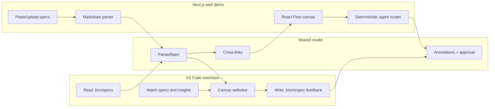

# Respec Architecture

This is the one supporting doc for the repo. The README shows the product; this page shows how the two deliverables fit together.

## System Shape

## Visual Flow

| Load specs | Review graph |
|------------|--------------|
|  |  |

| Add feedback | Compile handoff |
|--------------|-----------------|
|  |  |

## Implemented

- Web app parses Kiro-style markdown into typed requirements, design elements, and tasks.
- React Flow renders the three-column canvas, cross-links, hover states, annotations, agent rail, and approval bar.
- DriftDetector and GapFinder run deterministic checks through Next.js API routes.
- FeedbackCompiler converts annotations into structured markdown.
- VS Code extension reads workspace specs, renders the same webview, and writes `.kiro/respec/feedback.md`.

## Planned Path

- Replace deterministic checks with Bedrock/Claude-powered semantic agents.
- Stream live Kiro generation events into the canvas.
- Persist collaborative review sessions.
- Generate tests from EARS requirements.
