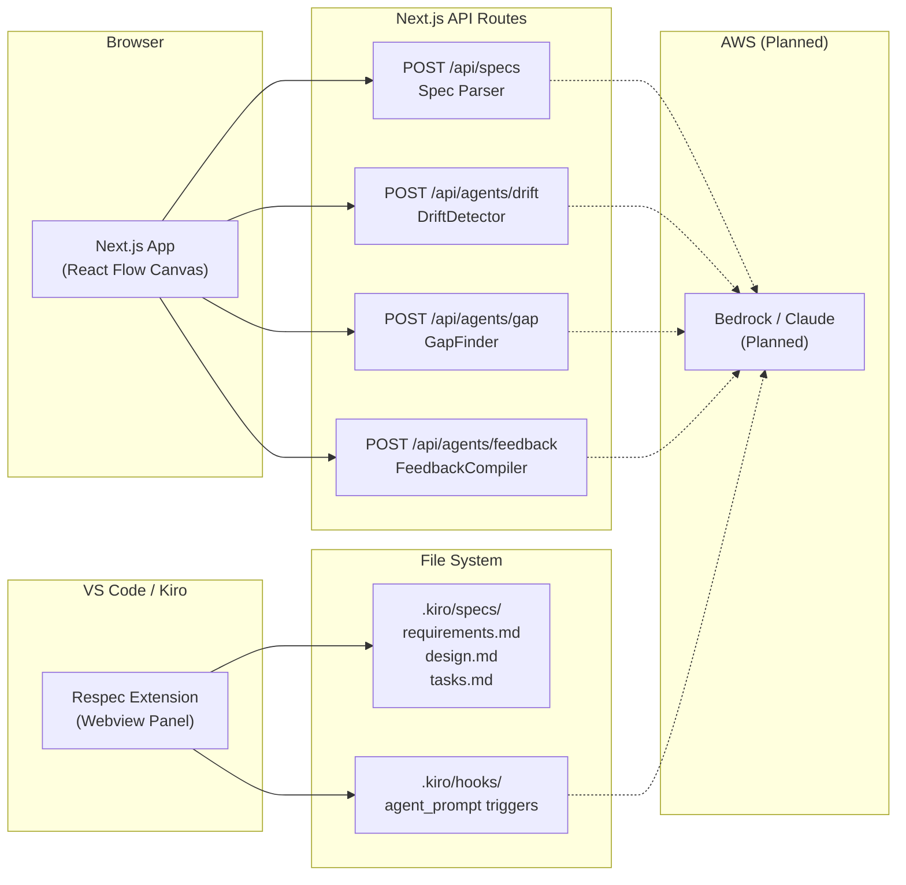
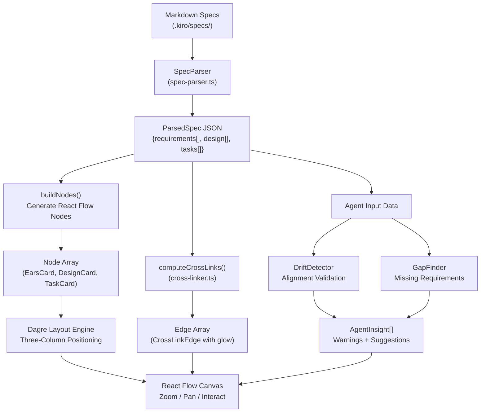
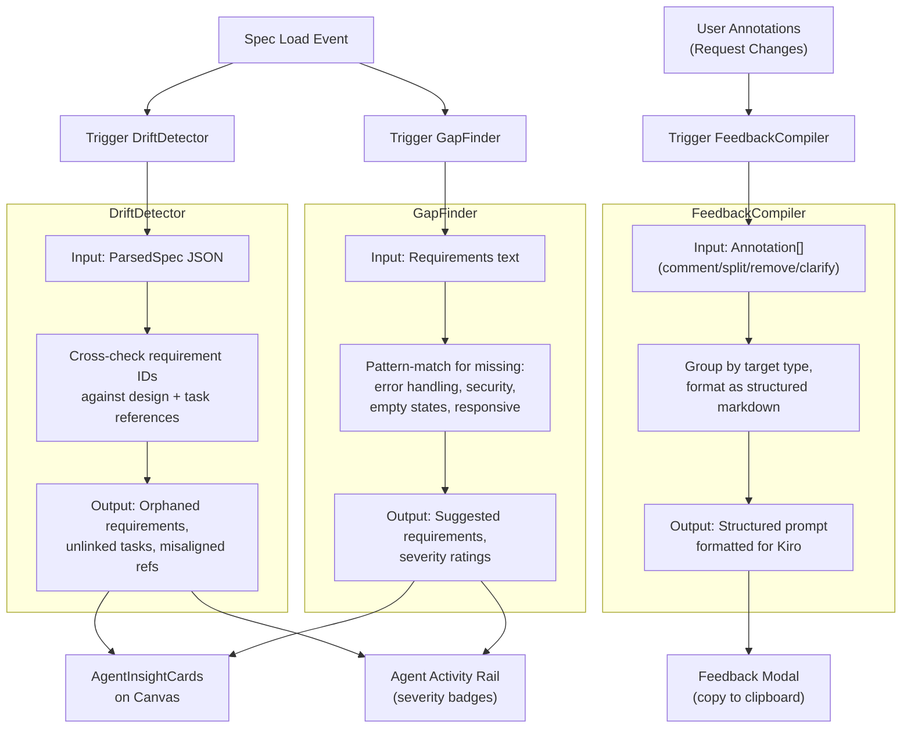
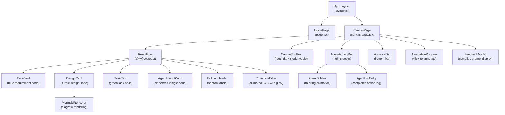

# Architecture Diagrams

These diagrams illustrate the system architecture of Respec, from high-level component interactions down to the frontend component hierarchy. Each diagram focuses on a different aspect of the system to provide a complete picture of how data flows from markdown specs through parsing, rendering, and agent validation.

---

## High-Level System Architecture

This diagram shows the two primary delivery paths: the Next.js web application served through a browser, and the VS Code extension that integrates directly with the Kiro IDE through file-based hooks.

> **Note:** Agents currently use deterministic logic (set operations, pattern matching, and template formatting) for reliability and fast response times. The architecture is designed for drop-in replacement with AWS Bedrock/Claude via the Strands SDK when LLM-powered analysis is desired. Dashed arrows indicate planned connections.

---

## Data Flow Pipeline

This diagram traces the path from raw markdown spec files through the parsing and rendering pipeline, showing how structured JSON feeds both the React Flow canvas and the cross-link computation engine.

---

## Agent Pipeline

This diagram details the three-agent validation system, showing trigger conditions, inputs, processing logic, and how outputs surface on the canvas and in the agent activity rail.

---

## Frontend Component Hierarchy

This diagram shows the React component tree from the root layout down through the canvas page, custom node types, edge types, overlay components, and the agent activity rail.

